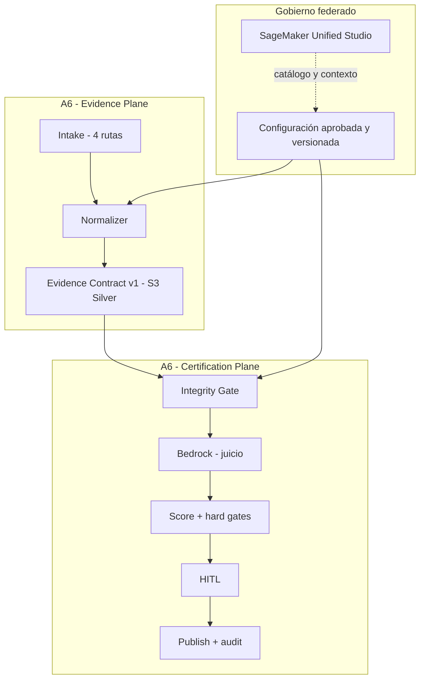
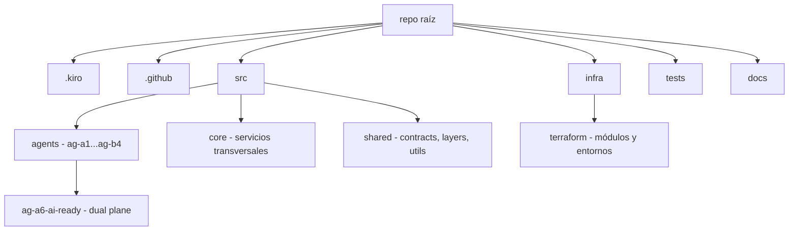
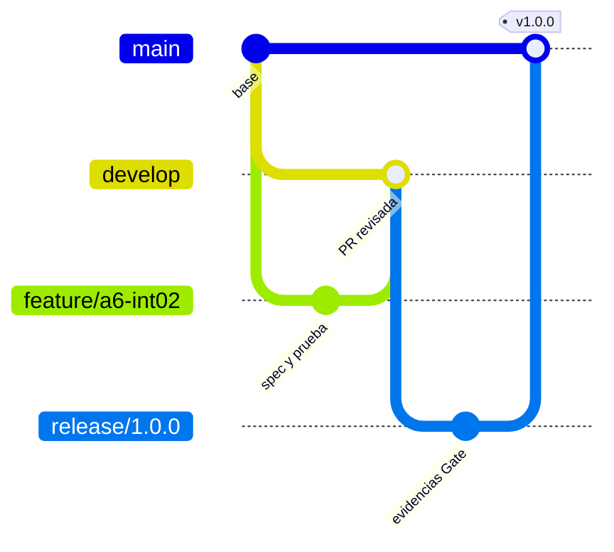
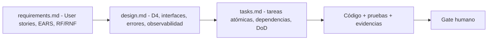
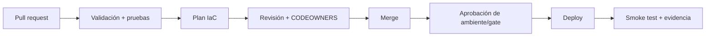
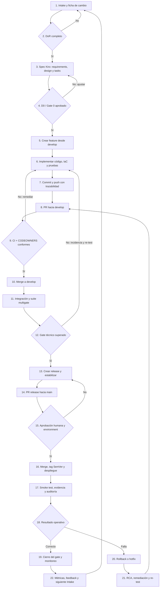

# Repositorio GitHub para Ecosistema Agéntico AWS - Banco Galicia

**Versión:** 1.1  
**Fecha de elaboración:** 2026-09-04  
**Clasificación sugerida:** Confidencial - Uso interno  
**Estado:** Diseño revisado con plan práctico de cierre de gaps; sujeto a aprobación Gate 0 / D0

> Este documento registra evidencia y decisiones verificables. No reproduce razonamiento interno privado. Cada decisión se clasifica como **Textual**, **Deductiva**, **Inductiva** o **Analógica**, e indica certeza y brechas.

## 1. Introducción y alcance

### 1.1 Propósito

La guía define una implementación reproducible del repositorio GitHub para las soluciones A1-A7 y B1-B4, con especialización ejecutable para A6 - Score AI Ready. El repositorio preserva la separación D4 entre Evidence Plane y Certification Plane, integra Spec-Driven Development (SDD) de Kiro y establece trazabilidad entre requerimiento, diseño, tarea, prueba, evidencia y gate.

### 1.2 Alcance

Incluye:

- estructura modular del código y de la infraestructura como código;
- estructura `.kiro/specs/`, reglas de steering y hooks propuestos;
- estrategia de ramas, revisiones, versionamiento y protección;
- mapeo de servicios y límites de autoridad IAM;
- CI/CD declarativo por validación, plan y despliegue controlado;
- script PowerShell idempotente en lo posible para crear el repositorio, contenido inicial, ramas y protecciones.

No incluye:

- despliegue de cargas AWS, cuentas, regiones, ARN, VPC o endpoints;
- valores de fórmula, pesos, umbrales, retención o modo de Object Lock;
- secretos, credenciales, volumetrías, costos o fechas no documentadas;
- una política IAM lista para producción sin inventario de recursos aprobado;
- automatización de aprobación humana, legal o regulatoria.

### 1.3 Documentación fuente y convención de citas

| Código | Documento | Versión/fecha observada | Uso principal |
|---|---|---|---|
| `[Plan_PoC]` | `Plan_PoC_a_MVP_A6_D4_Consolidado_v1.3(5).pdf` | v1.3 | D4, RF/RNF, integridad, gates, servicios y SDD |
| `[Resumen]` | `Resumen_Ejecutivo_CLevel_Ecosistema_Agentico_AWS_Banco_Galicia_v1.1.docx.pdf` | v1.1; contenido fechado 03/09/2026 | portafolio, C01-C14, roadmap y decisión ejecutiva |
| `[Propuesta]` | `Propuesta_Estrategia_Implementacion_Ecosistema_Agentico_AWS_Banca.docx (2)(5).pdf` | v1.0; 14/07/2026 | OGSM, portafolio, dependencias e inferencias consolidadas |
| `[KIRO-CSV]` | `kiro_completo.csv` | captura suministrada | inventario de enlaces oficiales Kiro |

Las páginas se citan por el número impreso. Cuando difiere del índice del PDF se expresa, por ejemplo, “pág. impresa 20 / pág. PDF 21”. Las citas textuales son breves; el resto se parafrasea para conservar precisión.

### 1.4 Matriz maestra de requisitos extraídos

#### Portafolio de agentes

| ID | Nombre | Plataforma principal | Dependencias críticas | Fase | Fuente | Tipo | Certeza |
|---|---|---|---|---|---|---|---|
| A1 | Asistente conversacional | Bedrock + Agents/AgentCore + KB | A4, Customer 360, APIs core, identidad, Guardrails, BCRA | Ciclos 4-5 | `[Resumen]`, pág. 15; `[Propuesta]`, pág. 12 | Textual | Alta |
| A2 | Agente BI / Power BI | Bedrock Agents + KB + Catalog | Metadatos, métricas consensuadas, permisos BI e incidentes | Ciclo 3 | mismas fuentes | Textual | Alta |
| A3 | Agente ServiceNow | Bedrock Agents/AgentCore + Lambda | API ServiceNow, permisos delegados, corpus y confirmación | Ciclo 3 | mismas fuentes | Textual | Alta |
| A4 | RAG gobernado | Bedrock KB + OpenSearch + S3 | Conectores, metadata, gobierno del conocimiento y control de contexto | Ciclo 2 | mismas fuentes | Textual | Alta |
| A5 | Text-to-SQL Gold | KB estructurada + Redshift + broker | Gold, RLS, masking, identidad, parser, EXPLAIN y límites | Ciclo 4 | mismas fuentes | Textual | Alta |
| A6 | Score AI Ready | Bedrock asistido + Lambda + Catalog | Fórmula, pesos, DQ, CMDB, ServiceNow e histórico | Ciclo 1 | mismas fuentes | Textual | Alta |
| A7 | Customer 360 + NBA | Bedrock + SageMaker AI | Customer 360, features, elegibilidad, Clarify y HITL | Ciclos 4-5 | mismas fuentes | Textual | Alta |
| B1 | Fraude en tiempo real | Kinesis + SageMaker AI + Bedrock narrativo | Streaming, features online, latencia, falsos positivos y MLOps | Ciclo 5 | mismas fuentes | Textual | Alta |
| B2 | IDP | Bedrock Data Automation + S3 + workflows | Blueprints, dataset real, umbral por campo, retención y revisión | Ciclo 3 | mismas fuentes | Textual | Alta |
| B3 | Asistente interno | Bedrock Agents + A4 | A4 operativo, permisos por rol y convivencia con Copilot | Ciclo 3 | mismas fuentes | Textual | Alta |
| B4 | Scoring crediticio | SageMaker AI + Clarify + Feature Store | Históricos, política de riesgo, expediente, sesgo y drift | Ciclo 5 | mismas fuentes | Textual | Alta |

**Cruce:** `[Resumen]` y `[Propuesta]` son consistentes. La leyenda de `[Resumen]` atribuye la matriz a “Factibilidad, págs. 20-21”; el archivo Factibilidad independiente no fue suministrado, pero la matriz está incorporada literalmente en ambos documentos.

#### Arquitectura D4

| Plano | Componentes | Responsabilidad | Fuente | Tipo | Certeza |
|---|---|---|---|---|---|
| Evidence Plane | Intake, collectors/lookups, Normalizer, S3 Bronze, S3 Silver | Capturar cuatro rutas, consultar fuentes read-only, normalizar, calcular hashes y producir Evidence Contract v1 | `[Plan_PoC]`, págs. 4-5 | Textual | Alta |
| Frontera | Evidence Contract v1 | Único contrato entre planos; referencias, configuración, timestamps e integridad; no datasets completos ni PII en claro | `[Plan_PoC]`, pág. 5 | Textual | Alta |
| Certification Plane | Integrity Gate, juicio Bedrock, scoring, hard gates, HITL, Publish/Audit | Consumir el contrato read-only, interpretar, calcular fuera del LLM, autorizar humanamente y publicar | `[Plan_PoC]`, pág. 6 | Textual | Alta |
| Gobierno federado | SageMaker Unified Studio | Proyectos, catálogo, Data Products, owners, glosarios y metadata; no runtime universal ni motor de score | `[Plan_PoC]`, pág. 6; `[Resumen]`, págs. 7-8 | Textual | Alta |

> 📄 Cita breve: “Evidence-first: ningún juicio de certificación inicia antes de validar el Evidence Contract.” `[Plan_PoC]`, pág. 4.  
> ✅ Verificación cruzada: `[Resumen]`, págs. 3-4 y 12, mantiene la misma separación de autoridad.  
> ⚠️ Gap: el backing store de `configuration_ref` se decide en Gate 0; no se fija en este repositorio.

#### Reglas INT-01 a INT-07

| ID | Regla | Descripción normalizada | Obligatoriedad | Fuente |
|---|---|---|---|---|
| INT-01 | Inmutabilidad | Un contrato generado y hasheado no se modifica; un cambio crea nuevo `evaluation_id` | Sí | `[Plan_PoC]`, pág. impresa 20 / PDF 21 |
| INT-02 | Hash del contrato | `contract_sha256` se calcula excluyendo su propio campo | Sí | misma |
| INT-03 | Hash de evidencia | Cada `source_ref` contiene SHA-256 del objeto | Sí | misma |
| INT-04 | Firma digital | KMS recomendado en PoC y obligatorio en MVP | PoC recomendado / MVP sí | misma |
| INT-05 | Correlation ID | Propagación E2E sin modificación | Sí | misma |
| INT-06 | Configuration ref | Rúbrica, fórmula y prompt apuntan a versiones inmutables y aprobadas | Sí | misma |
| INT-07 | No PII | Contrato y evidencia referenciada sin PII en claro | Sí | misma |

**Tipo:** textual. **Certeza:** alta. **Cruce:** consistente con RF-03 a RF-06, RNF-02/03/04/07/10 y el flujo formal del Anexo G.

#### Controles C01-C14

| ID | Restricción | Fase principal | Fuente |
|---|---|---|---|
| C01 | HITL obligatorio | PoC | `[Resumen]`, pág. 12 |
| C02 | Fuentes read-only | PoC | misma |
| C03 | PII no persistida en claro | PoC | misma |
| C04 | Rúbricas DP/KB separadas | PoC | misma |
| C05 | Recertificación por cambio/expiry | MVP / Gate 4 | misma |
| C06 | Correlation ID E2E | PoC | misma |
| C07 | Configuración versionada/aprobada | PoC | misma |
| C08 | Observabilidad corporativa | PoC | misma |
| C09 | Costo por evaluación/tokens | PoC | misma |
| C10 | Teradata sin acceso directo agéntico | PoC | misma |
| C11 | PoC simple y acotada | PoC | `[Resumen]`, pág. 13 |
| C12 | Sin cumplimiento implícito si falta evidencia | PoC | misma |
| C13 | Owner, SLO y runbook | MVP / Gate 4 | misma |
| C14 | APIs/conectores probados | PoC | misma |

**Tipo:** textual. **Certeza:** alta. **Gap de fuente:** el prompt atribuye C01-C14 al Plan PoC, págs. 13-14; allí se encuentran work packages, pruebas y servicios, no esta tabla. La fuente suministrada que contiene el catálogo C01-C14 es `[Resumen]`, págs. 12-13.

#### Objetivos OGSM

| ID | Objetivo | Soluciones asociadas | Fuente |
|---|---|---|---|
| O-01 | Visión gobernada y confiable del cliente | Customer 360, A1, A5, A7 | `[Propuesta]`, pág. 6 |
| O-02 | Base de conocimiento gobernada y auditable | A4, A1, A2, A3 | misma |
| O-03 | Certificación automatizada de fuentes AI Ready / Data Segura | A6, A1, A5, A7 | misma |
| O-04 | Canales conversacionales con controles regulatorios y de seguridad | A1, A4, A6 | misma |
| O-05 | Acceso a datos y BI mediante agentes gobernados | A2, A5, A6 | misma |
| O-06 | Optimización operativa mediante automatización inteligente | A3, A4, A6 | misma |

**Tipo:** textual. **Certeza:** alta. **Cruce:** `[Resumen]`, pág. 3, contiene una formulación ejecutiva concordante.

#### Requisitos técnicos mínimos

| Servicio | Uso A6 | Requisito del repositorio | Fuente |
|---|---|---|---|
| API Gateway | Entrada API/SPA | contrato de interfaz, autorización, throttling y `correlation_id` | `[Plan_PoC]`, pág. 13 |
| Cognito | Identidad SPA cuando aplique | configuración sin secretos y scopes documentados | misma |
| Lambda | Intake, Normalizer, integridad y scoring | módulos pequeños, stateless e idempotentes | misma |
| Step Functions | Orquestación, retries, hard gates y HITL | ASL versionado y callback con task token | misma |
| S3 | Bronze/Silver, contratos y auditoría | versioning, cifrado y Object Lock según política | misma |
| Bedrock | Juicio semántico | salida estructurada; sin score/autorización final | misma |
| Bedrock Guardrails | filtros y datos sensibles | entradas/salidas sujetas a policy | misma |
| EventBridge/SQS | MVP event-ready | mensajes por referencia, DLQ y replay | misma |
| CloudWatch/X-Ray | métricas, logs, alarmas y trazas | `correlation_id` y telemetría sin PII | misma |
| SageMaker Unified Studio | proyectos, catálogo y gobierno | metadata, owners, glosarios y referencias gobernadas | misma |
| KMS | cifrado y firma | separación de claves/policies; firma/verificación MVP | misma |

## 2. Decisión arquitectónica del repositorio

### 2.1 Monorepo modular frente a multirepo

| Criterio | Monorepo modular | Multirepo |
|---|---|---|
| Contratos compartidos | Cambio atómico de contrato, consumidores y pruebas | Requiere coordinación/versiones entre repositorios |
| Controles transversales | Una implementación y suite común | Riesgo de divergencia |
| Aislamiento de despliegue | Se logra mediante rutas y workflows con filtros | Natural por repositorio |
| Permisos de código | Requiere CODEOWNERS y reglas por ruta | Más directo por repositorio |
| Ciclos A1-A7/B1-B4 | Permite habilitación progresiva sin duplicar plataforma | Puede ajustarse mejor a equipos totalmente autónomos |

**Decisión propuesta:** monorepo modular durante Ciclos 0-3 y PoC/MVP de A6; reevaluación ADR antes de industrializar cargas de alto impacto del Ciclo 5.

**Justificación:** D4 exige contratos y controles comunes; A6 y A4 son habilitadores fundacionales, y el portafolio se despliega por gates. Un monorepo facilita una única trazabilidad de specs, contratos, pruebas y IaC sin obligar a desplegar todos los agentes juntos.

| Evidencia | Tipo | Certeza | Verificación |
|---|---|---|---|
| A6/A4 preceden al resto; plataforma reutilizable de controles | Deductiva desde `[Propuesta]`, págs. 3, 13, 20 y 28 | Alta | No contradice roadmap ni D4 |
| Selección monorepo | Analógica de contratos compartidos + despliegue por módulos | Media | Requiere ratificación Gate 0 |

> ⚠️ Gap: ninguna fuente ordena monorepo. La decisión debe registrarse como ADR-REP-001 y aprobarse en Gate 0.

### 2.2 Vista de arquitectura y límites de código



📄 **Fuente:** `[Plan_PoC]`, págs. 4-6.  
✅ **Verificación:** Bedrock interpreta; el código calcula; HITL autoriza.  
⚠️ **Gap:** no se representa un backing store definitivo para configuración.

## 3. Estructura de directorios detallada

### 3.1 Árbol lógico



### 3.2 Estructura 

```text
galicia-ecosistema-agentico-aws/
├── .github/
│   ├── CODEOWNERS
│   ├── pull_request_template.md
│   └── workflows/
│       ├── validate.yml
│       ├── terraform-plan.yml
│       └── deploy.yml
├── .kiro/
│   ├── steering/
│   │   ├── product.md
│   │   ├── architecture-d4.md
│   │   ├── security-governance.md
│   │   └── repository-conventions.md
│   ├── hooks/
│   │   └── README.md
│   └── specs/
│       ├── ag-a1-conversational/{requirements.md,design.md,tasks.md}
│       ├── ag-a2-bi/{requirements.md,design.md,tasks.md}
│       ├── ag-a3-servicenow/{requirements.md,design.md,tasks.md}
│       ├── ag-a4-rag-governed/{requirements.md,design.md,tasks.md}
│       ├── ag-a5-text-to-sql/{requirements.md,design.md,tasks.md}
│       ├── ag-a6-ai-ready/{requirements.md,design.md,tasks.md}
│       ├── ag-a7-customer360-nba/{requirements.md,design.md,tasks.md}
│       ├── ag-b1-fraud/{requirements.md,design.md,tasks.md}
│       ├── ag-b2-idp/{requirements.md,design.md,tasks.md}
│       ├── ag-b3-internal-assistant/{requirements.md,design.md,tasks.md}
│       └── ag-b4-credit-scoring/{requirements.md,design.md,tasks.md}
├── src/
│   ├── agents/
│   │   ├── group-a/ag-a1 ... ag-a7/
│   │   ├── group-b/ag-b1 ... ag-b4/
│   │   └── group-a/ag-a6-ai-ready/
│   │       ├── evidence-plane/{intake,collectors,normalizer,storage}/
│   │       ├── certification-plane/{integrity,judgment,scoring,gates,hitl,publish}/
│   │       └── config/
│   ├── core/
│   │   ├── core-identity/
│   │   ├── core-observability/
│   │   ├── core-governance/
│   │   └── core-audit/
│   └── shared/
│       ├── contracts/evidence-contract/v1/
│       ├── layers/
│       └── utils/
├── infra/
│   └── terraform/
│       ├── modules/{ag-a6,core-identity,core-observability,core-governance}/
│       └── environments/{poc,mvp}/
├── tests/
│   ├── unit/
│   ├── contract/
│   ├── integration/
│   ├── security/
│   ├── e2e/
│   └── fixtures/evidence-contract/
├── docs/
│   ├── adr/
│   ├── controls/
│   ├── runbooks/
│   ├── traceability/
│   └── diagrams/
├── scripts/
├── .editorconfig
├── .gitignore
├── CHANGELOG.md
├── CONTRIBUTING.md
├── README.md
└── SECURITY.md
```

### 3.3 Tabla de directorios

| Ruta | Propósito | Contenido típico | Base documental / clasificación |
|---|---|---|---|
| `.kiro/specs/<agente>/` | Spec ejecutable por agente | `requirements.md`, `design.md`, `tasks.md` | `[Plan_PoC]`, pág. 9; textual |
| `.kiro/steering/` | contexto persistente global | D4, seguridad, producto, convenciones | `[KIRO-CSV]` + Kiro Steering; deductiva |
| `.kiro/hooks/` | definición y gobierno de automatizaciones Kiro | inventario, eventos, acciones permitidas | Kiro Hooks; analógica, Gate 0 |
| `src/agents/` | módulos con prefijo `ag-` | lógica exclusiva A1-A7/B1-B4 | prompt + portafolio; textual/deductiva |
| `src/core/` | capacidades transversales `core-` | identidad, observabilidad, gobierno, auditoría | `[Propuesta]`, págs. 9, 14-15; deductiva |
| `src/shared/contracts/` | contratos estables | schema Evidence Contract v1 y ejemplos | `[Plan_PoC]`, págs. 5, 31-33; textual |
| `src/shared/layers/` | dependencias compartidas de Lambda | paquetes sin lógica de autorización | prompt + Lambda; analógica |
| `src/shared/utils/` | utilidades puras | IDs, canonicalización, logging seguro | RF/RNF/INT; deductiva |
| `infra/terraform/modules/` | módulos aislados | agente/core por límite de despliegue | tarea solicitada; propuesta Gate 0 |
| `infra/terraform/environments/` | composición por etapa | PoC y MVP sin secretos | roadmap; deductiva |
| `tests/contract/` | contrato e integridad | schema, vectores hash, INT-01…07 | `[Plan_PoC]`, págs. 12, 20, 33-34; textual |
| `docs/traceability/` | evidencia auditable | RF/RNF → tarea → prueba → DoD → gate | WP-09; deductiva |

## 4. Estrategia de control de versiones

### 4.1 Ramas

| Rama | Propósito | Origen | Destino | Retención |
|---|---|---|---|---|
| `main` | estado liberable y trazable | `release/*`, `hotfix/*` | producción tras gate | permanente |
| `develop` | integración de siguiente versión | `feature/*` | `release/*` | permanente |
| `feature/<id>-<slug>` | cambio pequeño trazado a spec/tarea | `develop` | `develop` por PR | eliminar al fusionar |
| `release/<semver>` | estabilización, evidencias y gate | `develop` | `main` y retorno a `develop` | eliminar al cerrar |
| `hotfix/<id>-<slug>` | corrección urgente aprobada | `main` | `main` y `develop` | eliminar al cerrar |

**Clasificación:** la lista de ramas es requisito explícito del prompt; no aparece en los adjuntos. Su adopción es analógica a un GitFlow simplificado. **Certeza:** media. **Gap:** debe ajustarse al modelo corporativo GitHub antes de Gate 0.



### 4.2 Protección mínima

Para `main`:

- PR obligatoria y dos aprobaciones;
- conversaciones resueltas;
- checks `validate`, `contract-tests`, `security-checks` y `terraform-plan` requeridos solo después de que esos nombres existan y sean estables;
- commits lineales; bloqueo de force-push y borrado;
- CODEOWNERS requerido;
- administradores sujetos a la regla, salvo procedimiento break-glass corporativo;
- despliegue productivo condicionado a un GitHub Environment con aprobación humana y al gate documental correspondiente.

Para `develop`:

- PR obligatoria y una aprobación;
- conversaciones resueltas;
- checks estables requeridos;
- sin force-push ni borrado.

**Fuente externa oficial:** GitHub permite exigir PR, revisiones, checks, resolución de conversaciones e historia lineal mediante protección/rulesets. **Tipo:** validación técnica externa. **Certeza:** alta.  
⚠️ **Gap:** equipos, usuarios de bypass, nombres de checks y disponibilidad según plan/licencia no están documentados. El script aplica protección básica sin checks nombrados para evitar bloquear un repositorio recién creado.

### 4.3 Pull request y versionamiento

Todo PR debe:

1. enlazar spec y tareas Kiro;
2. indicar RF/RNF, INT/C y gate afectados;
3. incluir pruebas y evidencia sin PII;
4. actualizar contrato/ADR si modifica interfaz o autoridad;
5. obtener revisión del owner de ruta y, para D4/seguridad, del owner transversal.

Se adopta SemVer `MAJOR.MINOR.PATCH`:

- **MAJOR:** cambio incompatible de contrato/interfaz;
- **MINOR:** capacidad compatible;
- **PATCH:** corrección compatible.

Los tags son `vX.Y.Z`. Evidence Contract mantiene versión propia: cambiarlo no implica automáticamente la misma versión del producto. **Tipo:** analogía de ingeniería; **certeza:** media; **aprobación:** Gate 0.

## 5. Configuración Kiro y SDD

### 5.1 Flujo de specs



📄 `[Plan_PoC]`, pág. 9, establece Requirements → Design → Tasks y `.kiro/specs/`.  
🔗 Kiro confirma Feature Specs, flujo Requirements-First y EARS.  
✅ Para A6 se exige revisión humana en D0/G-IC; por ello no se recomienda Quick Spec como vía aprobatoria.  
⚠️ Los nombres exactos de archivos de hooks no están fijados en los adjuntos; `.kiro/hooks/README.md` actúa como registro hasta validar la exportación generada por la versión instalada de Kiro.

### 5.2 Steering global

| Archivo | Reglas mínimas |
|---|---|
| `product.md` | O-01…O-06, portafolio, ciclos, alcance/no alcance |
| `architecture-d4.md` | separación de planos, Evidence Contract, cuatro rutas, event-ready |
| `security-governance.md` | C01-C14, INT-01…07, least privilege, no PII, HITL |
| `repository-conventions.md` | prefijos, ramas, SemVer, trazabilidad y DoD |

Estos archivos son Markdown persistente de contexto, coherente con Kiro Steering. No sustituyen políticas ejecutables, aprobación ni documentación fuente.

### 5.3 Hooks propuestos y límites

| Evento lógico | Acción permitida | Bloqueo |
|---|---|---|
| guardar `requirements.md` | revisar presencia de User Story, EARS, RF/RNF y fuente | no aprobar D0 automáticamente |
| cambiar schema de Evidence Contract | ejecutar contract tests y vectores hash | no actualizar consumidores sin PR |
| modificar `scoring/` o `gates/` | ejecutar determinismo y suite negativa HG-INT | no cambiar fórmula/config aprobada |
| preparar commit | verificar secretos, PII y trazabilidad | no enviar contenido a fuentes externas |

**Tipo:** deducción desde WP-09, RNF y Kiro Hooks. **Certeza:** media. **Gap:** los triggers y acciones exactos deben crearse desde la interfaz/versión corporativa de Kiro y revisarse antes de habilitarlos.

### 5.4 Ejemplo `requirements.md` para A6

```markdown
# A6 - Score AI Ready - Requirements

## Trazabilidad
- Fuente: Plan_PoC v1.3, RF-01 a RF-12, RNF-01 a RNF-10, INT-01 a INT-07.
- Gate: D0/G-IC antes de Construction.

## US-A6-01 - Normalizar evidencia
Como owner de un activo, se requiere una evaluación trazable para decidir su certificación.

### EARS
- WHEN una solicitud autorizada ingresa por cualquiera de las cuatro rutas,
  THE SYSTEM SHALL crear `evaluation_id` y `correlation_id` y normalizarla a Evidence Contract v1.
- WHEN el contrato contiene propiedades no permitidas o PII en claro,
  THE SYSTEM SHALL rechazarlo antes del juicio GenAI.
- WHEN una evidencia se referencia,
  THE SYSTEM SHALL registrar URI, tipo y SHA-256 sin embebir el dataset completo.

## US-A6-02 - Certificar con separación de autoridad
- WHEN el Integrity Gate valida contrato, configuración y referencias,
  THE SYSTEM SHALL solicitar un juicio estructurado a Bedrock sin delegarle el score final.
- WHEN existe juicio válido,
  THE SYSTEM SHALL calcular score y hard gates determinísticamente con configuración aprobada.
- WHEN un revisor autorizado no ha decidido,
  THE SYSTEM SHALL NOT publicar una certificación final.

## Criterios de aceptación
- RF-01 a RF-10 para PoC; RF-11 y RF-12 para MVP.
- INT-01 a INT-07 y C01-C14 según su fase.
- Mismo contrato + configuración produce el mismo score/hard gates.
```

### 5.5 Ejemplo `design.md` para A6

```markdown
# A6 - Score AI Ready - Design

## Decisión
D4 Hybrid Dual-Plane Event-Ready.

## Evidence Plane
Intake -> collectors read-only -> Normalizer -> S3 Bronze/Silver.
Solo Normalizer crea el contrato.

## Certification Plane
Lectura inmutable -> Integrity Gate -> Bedrock/Guardrails -> scoring determinístico
-> hard gates -> callback HITL -> Publish/Audit.

## Interfaces
- SPA/API -> Intake: asset identity, requester, trigger metadata.
- Normalizer -> S3 Silver: contract + hash; devuelve URI/versionId.
- Bedrock -> Scoring: judgments estructurados; nunca score final.

## Error handling
- hash/ID/config/ref inválido: rechazo antes de Bedrock.
- timeout/retry: controlado e idempotente; DLQ/replay en MVP.
- timeout HITL: estado consistente y auditado.

## Observabilidad
Logs, métricas y trazas por `evaluation_id`, `correlation_id` y `contract_sha256`, sin PII.

## Decisiones pendientes Gate 0
Serialización canónica; backing store de configuración; región/modelo;
modo/retención Object Lock; identidad corporativa; owners y RACI nominal.
```

### 5.6 Ejemplo `tasks.md` para A6

```markdown
# A6 - Score AI Ready - Tasks

- [ ] WP-01 Intake e identidad E2E [RF-01, RNF-01, RNF-03] - DoD: IDs y audit.
- [ ] WP-02 Storage y Normalizer [RF-02..06, INT-01..07] - DoD: schema/hash/no PII.
- [ ] WP-03 Collectors y cuatro rutas [C02, C14] - DoD: read-only/timeouts/referencias.
- [ ] WP-04 Juicio GenAI [RF-07, C04] - DoD: salida estructurada/Guardrails.
- [ ] WP-05 Scoring y hard gates [RF-08, RNF-04] - DoD: determinismo/suite negativa.
- [ ] WP-06 HITL y publicación [RF-09..10, C01] - DoD: callback/identidad/audit.
- [ ] WP-07 Observabilidad [C06, C08, C09] - DoD: métricas/alarmas/trazas.
- [ ] WP-08 Event-ready MVP [RF-11..12, C05, C13] - DoD: DLQ/replay/recertificación.
- [ ] WP-09 SDD y pruebas - DoD: spec-diseño-tarea-prueba-evidencia trazables.
```

## 6. Infraestructura como código (IaC)

### 6.1 Decisión

Se propone **Terraform como única fuente primaria de IaC** para PoC/MVP. CDK podrá incorporarse solo mediante ADR posterior y para módulos que no dupliquen recursos administrados por Terraform.

**Tipo:** opción solicitada por el prompt, no impuesta por las fuentes. **Certeza:** media. **Gap:** lenguaje CDK, versión de Terraform, provider, backend, cuentas y estrategia de estado no están documentados.

### 6.2 Capas

| Capa | Contenido | Regla |
|---|---|---|
| `modules/ag-a6` | composición A6 por planos | no contiene valores de entorno |
| `modules/core-*` | observabilidad, identidad, gobierno | interfaces explícitas y mínimo privilegio |
| `environments/poc` | PoC sin eventos productivos implícitos | 1 DP + 1 KB, HITL 100% |
| `environments/mvp` | EventBridge/SQS, DLQ/replay y recertificación | solo tras Gate 3 |

No se versionan secretos ni archivos `*.tfstate`. Variables sensibles se reciben desde el mecanismo corporativo aprobado y desde GitHub Environments/identidad federada cuando sea validado. El repositorio conserva solo nombres, descripciones y validaciones, nunca valores.

### 6.3 Flujo de despliegue

1. PR ejecuta formato, validación, lint, pruebas y `terraform plan` sin aplicar.
2. Artefactos de plan se asocian al commit y ambiente, sin incluir secretos.
3. Merge a rama autorizada habilita despliegue al ambiente correspondiente.
4. El ambiente exige aprobación humana y gate documental.
5. Smoke tests y evidencia actualizan trazabilidad; un fallo detiene promoción.

## 7. Servicios AWS transversales

### 7.1 Mapeo agente → servicios

La tabla del apartado 1.4 constituye el mapeo primario. Los servicios compartidos deducidos son:

| Capacidad | Servicios documentados | Consumidores | Fuente / tipo |
|---|---|---|---|
| Gobierno de datos/metadata | SageMaker Unified Studio/Catalog | A1-A7 y B según activos | `[Plan_PoC]`, pág. 6; deductiva |
| Runtime GenAI | Bedrock Agents o AgentCore según complejidad | A1-A4, A6, B3; narrativo B1 | `[Propuesta]`, págs. 5, 8-9, 12; textual |
| ML/MLOps | SageMaker AI, Clarify, Feature Store | A7, B1, B4 | `[Propuesta]`, págs. 10, 12; textual |
| Evidencia y objetos | S3 | A4, A6, B2 y compartidos | matrices + D4; textual/deductiva |
| Identidad/autorización | IAM; Cognito cuando aplique | transversal | `[Plan_PoC]`, págs. 13, 16; textual |
| Orquestación | Step Functions; workflows | A6, B2 | `[Plan_PoC]`, págs. 6, 13; textual |
| Observabilidad | CloudWatch/X-Ray | transversal, explícito en A6 | `[Plan_PoC]`, págs. 13, 15; deductiva |

### 7.2 Matriz IAM de capacidad, no política inventada

| Rol lógico | Permitido | Denegación/límite arquitectónico | Fuente |
|---|---|---|---|
| Solicitante | crear evaluación; leer su estado | no modificar evidencia/configuración | `[Plan_PoC]`, pág. 16 |
| Revisor HITL | leer resumen; aprobar/rechazar | no cambiar configuración | misma |
| Normalizer | leer fuentes aprobadas; escribir Silver; firmar si aplica | único creador del contrato | misma + INT-01/04 |
| Certification | leer contrato/configuración; invocar Bedrock; ejecutar score | no mutar contrato ni publicar sin HITL | misma |
| Publisher | escribir estado/audit tras HITL | no recalcular ni cambiar contrato | misma |
| Bedrock/LLM | juicio estructurado | sin credenciales humanas; sin score, publicación o configuración | misma |

No se entrega JSON IAM desplegable: faltan cuentas, regiones, recursos, KMS keys, buckets y condiciones corporativas. Fabricarlos contradiría Gate 0 y el requisito de mínimo privilegio.

### 7.3 Variables y secretos

| Clase | Ejemplos permitidos en configuración | Tratamiento |
|---|---|---|
| Identificadores no secretos | nombre lógico de ambiente, versión de schema | archivo versionado |
| Referencias gobernadas | nombre lógico de `configuration_ref` | resolución por versión aprobada |
| Secretos/credenciales | tokens, client secrets, claves | nunca Git; mecanismo corporativo pendiente |
| Identificadores sensibles de infraestructura | ARN, cuenta, endpoints privados | variables de ambiente protegidas; no ejemplos ficticios |

## 8. CI/CD y GitHub Actions

### 8.1 Pipelines

| Workflow | Trigger | Controles | Efecto |
|---|---|---|---|
| `validate.yml` | PR a `develop`/`main` | estructura Kiro, lint, unit, contract, INT/HG, secretos/PII | no despliega |
| `terraform-plan.yml` | PR con cambios `infra/**` | fmt, validate y plan | adjunta evidencia controlada |
| `deploy.yml` | merge/tag autorizado | gate de environment, apply, smoke/e2e | promoción por etapa |



**Gap:** runner, identidad AWS, mecanismo de secretos, ambientes, checks definitivos y estrategia de rollback requieren decisión corporativa. Los YAML iniciales creados por el script son placeholders seguros y no despliegan.

## 9. Guía rápida para desarrolladores

### 9.1 Prerrequisitos

- Git y PowerShell 7+;
- GitHub CLI `gh`, autenticado con permiso para crear/administrar el repositorio;
- acceso autorizado a la organización GitHub objetivo;
- Kiro instalado conforme a la guía oficial corporativamente aprobada;
- Terraform solo cuando Gate 0 confirme versión, provider y backend.

### 9.2 Inicio

```powershell
gh auth status
./Initialize-GaliciaAgenticRepo.ps1 `
  -Owner "ORGANIZACION_APROBADA" `
  -RepositoryName "galicia-ecosistema-agentico-aws" `
  -Visibility private
```

Luego:

1. abrir el directorio en Kiro;
2. revisar `.kiro/steering/`;
3. seleccionar `.kiro/specs/ag-a6-ai-ready/requirements.md`;
4. completar pendientes de Gate 0 y obtener aprobación;
5. crear `feature/<id>-<slug>` desde `develop`;
6. implementar únicamente tareas aprobadas y adjuntar evidencia al PR.

### 9.3 Convenciones

- agentes: `ag-a1-*` … `ag-a7-*`, `ag-b1-*` … `ag-b4-*`;
- transversales: `core-*`;
- Python/TypeScript/otro lenguaje: pendiente de stack aprobado; no se impone aquí;
- IDs de commit/PR: incluir WP, RF/RNF o control relevante;
- ningún log, fixture o evidencia contiene PII real;
- cambios a contratos o configuración requieren owner y gate.

## 10. Script de implementación

### 10.1 Características y límites

El script:

- valida `git`, `gh`, autenticación y parámetros;
- crea el repositorio remoto privado/interno/público mediante GitHub CLI;
- genera estructura, archivos iniciales, specs A6 y placeholders de los demás agentes;
- crea y publica `main` y `develop`;
- aplica protección básica a ambas ramas mediante API oficial;
- evita sobrescribir un directorio no vacío;
- no despliega AWS, no crea secretos y no inventa políticas IAM.

La protección inicial no exige status checks nominales porque GitHub requiere que esos checks existan. Se incorporan después de confirmar workflows/runners mediante ADR operativo.

### 10.2 Script PowerShell completo

Guárdese como `Initialize-GaliciaAgenticRepo.ps1`.

```powershell
#requires -Version 7.0
[CmdletBinding(SupportsShouldProcess)]
param(
    [Parameter(Mandatory)][ValidateNotNullOrEmpty()][string]$Owner,
    [Parameter()][ValidatePattern('^[A-Za-z0-9._-]+$')]
    [string]$RepositoryName = 'galicia-ecosistema-agentico-aws',
    [Parameter()][ValidateSet('private','internal','public')]
    [string]$Visibility = 'private',
    [Parameter()][string]$LocalParent = (Get-Location).Path,
    [Parameter()][switch]$SkipBranchProtection
)

$ErrorActionPreference = 'Stop'
Set-StrictMode -Version Latest

function Assert-Command([string]$Name) {
    if (-not (Get-Command $Name -ErrorAction SilentlyContinue)) {
        throw "Falta el comando requerido: $Name"
    }
}

function Write-Utf8NoBom([string]$Path, [string]$Content) {
    $parent = Split-Path -Parent $Path
    if ($parent) { New-Item -ItemType Directory -Force -Path $parent | Out-Null }
    [System.IO.File]::WriteAllText($Path, $Content, [System.Text.UTF8Encoding]::new($false))
}

Assert-Command git
Assert-Command gh
gh auth status | Out-Null

$repoRoot = Join-Path (Resolve-Path $LocalParent) $RepositoryName
if (Test-Path $repoRoot) {
    $items = @(Get-ChildItem -Force $repoRoot)
    if ($items.Count -gt 0) { throw "El destino existe y no está vacío: $repoRoot" }
} else {
    New-Item -ItemType Directory -Path $repoRoot | Out-Null
}

$agentSpecs = @(
    'ag-a1-conversational','ag-a2-bi','ag-a3-servicenow','ag-a4-rag-governed',
    'ag-a5-text-to-sql','ag-a6-ai-ready','ag-a7-customer360-nba',
    'ag-b1-fraud','ag-b2-idp','ag-b3-internal-assistant','ag-b4-credit-scoring'
)
$dirs = @(
    '.github/workflows','.kiro/steering','.kiro/hooks','src/core/core-identity',
    'src/core/core-observability','src/core/core-governance','src/core/core-audit',
    'src/shared/contracts/evidence-contract/v1','src/shared/layers','src/shared/utils',
    'infra/terraform/modules/ag-a6','infra/terraform/modules/core-identity',
    'infra/terraform/modules/core-observability','infra/terraform/modules/core-governance',
    'infra/terraform/environments/poc','infra/terraform/environments/mvp',
    'tests/unit','tests/contract','tests/integration','tests/security','tests/e2e',
    'tests/fixtures/evidence-contract','docs/adr','docs/controls','docs/runbooks',
    'docs/traceability','docs/diagrams','scripts'
)
foreach ($n in 1..7) { $dirs += "src/agents/group-a/ag-a$n" }
foreach ($n in 1..4) { $dirs += "src/agents/group-b/ag-b$n" }
$dirs += @(
    'src/agents/group-a/ag-a6/evidence-plane/intake',
    'src/agents/group-a/ag-a6/evidence-plane/collectors',
    'src/agents/group-a/ag-a6/evidence-plane/normalizer',
    'src/agents/group-a/ag-a6/evidence-plane/storage',
    'src/agents/group-a/ag-a6/certification-plane/integrity',
    'src/agents/group-a/ag-a6/certification-plane/judgment',
    'src/agents/group-a/ag-a6/certification-plane/scoring',
    'src/agents/group-a/ag-a6/certification-plane/gates',
    'src/agents/group-a/ag-a6/certification-plane/hitl',
    'src/agents/group-a/ag-a6/certification-plane/publish',
    'src/agents/group-a/ag-a6/config'
)
foreach ($spec in $agentSpecs) { $dirs += ".kiro/specs/$spec" }
foreach ($dir in $dirs) { New-Item -ItemType Directory -Force -Path (Join-Path $repoRoot $dir) | Out-Null }

$files = @{}
$files['README.md'] = @'
# Ecosistema Agéntico AWS - Banco Galicia

Monorepo modular sujeto a Gate 0/D0. A6 implementa D4 con separación estricta
entre Evidence Plane y Certification Plane. Véase `docs/adr/ADR-REP-001.md`.
'@
$files['.gitignore'] = @'
.terraform/
*.tfstate
*.tfstate.*
.env
.env.*
*.pem
*.key
__pycache__/
.pytest_cache/
node_modules/
dist/
coverage/
'@
$files['.editorconfig'] = @'
root = true
[*]
charset = utf-8
end_of_line = lf
insert_final_newline = true
trim_trailing_whitespace = true
[*.md]
trim_trailing_whitespace = false
'@
$files['CODE_OF_CONDUCT.md'] = "# Código de conducta`n`nPendiente de adopción corporativa.`n"
$files['CONTRIBUTING.md'] = @'
# Contribución

Partir de `develop`, usar `feature/<id>-<slug>` y abrir PR. Enlazar spec, controles,
pruebas, evidencia y gate. No incluir secretos ni PII.
'@
$files['SECURITY.md'] = @'
# Seguridad

No registrar vulnerabilidades en issues públicos. Utilizar el canal corporativo
aprobado. No versionar credenciales, PII, ARN ni endpoints sensibles.
'@
$files['CHANGELOG.md'] = "# Changelog`n`nFormato basado en versiones SemVer aprobadas.`n"
$files['.github/CODEOWNERS'] = @'
# Sustituir por equipos GitHub corporativos aprobados antes de exigir CODEOWNERS.
* @OWNER_PLACEHOLDER
/.kiro/ @OWNER_PLACEHOLDER
/src/agents/group-a/ag-a6/ @OWNER_PLACEHOLDER
/src/shared/contracts/ @OWNER_PLACEHOLDER
/infra/ @OWNER_PLACEHOLDER
'@
$files['.github/pull_request_template.md'] = @'
## Trazabilidad
- Spec/tarea:
- RF/RNF:
- INT/C:
- Gate:

## Validación
- [ ] Pruebas adjuntas
- [ ] Sin secretos ni PII
- [ ] Contratos/ADR actualizados cuando aplica
- [ ] Plan de reversa descrito
'@
$files['.github/workflows/validate.yml'] = @'
name: validate
on:
  pull_request:
    branches: [main, develop]
permissions:
  contents: read
jobs:
  repository-structure:
    runs-on: ubuntu-latest
    steps:
      - uses: actions/checkout@v4
      - name: Validate required A6 specs
        shell: bash
        run: |
          test -f .kiro/specs/ag-a6-ai-ready/requirements.md
          test -f .kiro/specs/ag-a6-ai-ready/design.md
          test -f .kiro/specs/ag-a6-ai-ready/tasks.md
'@
$files['.github/workflows/terraform-plan.yml'] = @'
name: terraform-plan
on:
  pull_request:
    paths: ['infra/terraform/**']
permissions:
  contents: read
jobs:
  gate-zero-required:
    runs-on: ubuntu-latest
    steps:
      - run: echo "Terraform version, provider and backend require Gate 0 approval."
'@
$files['.github/workflows/deploy.yml'] = @'
name: deploy
on:
  workflow_dispatch:
permissions:
  contents: read
jobs:
  blocked-until-approved:
    runs-on: ubuntu-latest
    steps:
      - run: echo "Deployment intentionally disabled pending environment and Gate approval."
'@
$files['docs/adr/ADR-REP-001.md'] = @'
# ADR-REP-001 - Monorepo modular

- Estado: Propuesto - pendiente Gate 0
- Decisión: monorepo modular para Ciclos 0-3 y A6 PoC/MVP.
- Reevaluación: antes de industrializar cargas Ciclo 5.
- Razón: contratos, controles y trazabilidad compartidos con despliegue por módulos.
'@
$files['.kiro/steering/product.md'] = "# Producto`n`nMantener O-01 a O-06, portafolio y ciclos conforme a documentos aprobados.`n"
$files['.kiro/steering/architecture-d4.md'] = @'
# Arquitectura D4

- Evidence-first.
- Solo Normalizer crea Evidence Contract.
- Certification consume el contrato en modo read-only.
- Bedrock interpreta; código determinístico calcula; HITL autoriza.
- EventBridge/SQS, DLQ/replay y recertificación corresponden al MVP/Gate 4.
'@
$files['.kiro/steering/security-governance.md'] = @'
# Seguridad y gobierno

Aplicar INT-01 a INT-07 y C01 a C14 según fase. No incluir PII ni secretos.
No inventar ARN, región, cuenta, retención, fórmula, pesos, umbrales o permisos.
'@
$files['.kiro/steering/repository-conventions.md'] = @'
# Convenciones

Agentes `ag-*`; transversales `core-*`; specs requirements/design/tasks;
trazabilidad RF/RNF -> tarea -> prueba -> evidencia -> gate.
'@
$files['.kiro/hooks/README.md'] = @'
# Hooks

Pendiente de validación en la versión corporativa de Kiro. Ningún hook puede
aprobar gates, cambiar configuración aprobada, desplegar o exfiltrar contenido.
'@

$files['.kiro/specs/ag-a6-ai-ready/requirements.md'] = @'
# A6 - Requirements

## EARS
- WHEN una solicitud autorizada ingresa por una de las cuatro rutas,
  THE SYSTEM SHALL crear IDs y normalizar a Evidence Contract v1.
- WHEN falla schema, hash, referencia, configuración o control de PII,
  THE SYSTEM SHALL rechazar antes de Bedrock.
- WHEN no existe aprobación HITL,
  THE SYSTEM SHALL NOT publicar certificación final.
'@
$files['.kiro/specs/ag-a6-ai-ready/design.md'] = @'
# A6 - Design

D4: Intake/Collectors/Normalizer/S3 -> Evidence Contract -> Integrity Gate ->
Bedrock/Guardrails -> scoring determinístico -> hard gates -> HITL -> Publish/Audit.
'@
$files['.kiro/specs/ag-a6-ai-ready/tasks.md'] = @'
# A6 - Tasks

- [ ] WP-01 Intake e identidad
- [ ] WP-02 Storage y Normalizer
- [ ] WP-03 Collectors y cuatro rutas
- [ ] WP-04 Juicio GenAI
- [ ] WP-05 Scoring y hard gates
- [ ] WP-06 HITL y publicación
- [ ] WP-07 Observabilidad
- [ ] WP-08 Event-ready MVP
- [ ] WP-09 SDD y pruebas
'@

foreach ($spec in $agentSpecs | Where-Object { $_ -ne 'ag-a6-ai-ready' }) {
    $files[".kiro/specs/$spec/requirements.md"] = "# $spec - Requirements`n`nPendiente de Intake, DoR y D0.`n"
    $files[".kiro/specs/$spec/design.md"] = "# $spec - Design`n`nNo construir antes de aprobación de requisitos y fase.`n"
    $files[".kiro/specs/$spec/tasks.md"] = "# $spec - Tasks`n`n- [ ] Completar trazabilidad y gate aplicable.`n"
}

foreach ($entry in $files.GetEnumerator()) {
    Write-Utf8NoBom (Join-Path $repoRoot $entry.Key) $entry.Value
}
Get-ChildItem -Directory -Recurse $repoRoot | ForEach-Object {
    if (-not (Get-ChildItem -Force $_.FullName)) {
        Write-Utf8NoBom (Join-Path $_.FullName '.gitkeep') ""
    }
}

Push-Location $repoRoot
try {
    git init -b main
    git add .
    git commit -m 'chore: initialize governed agentic ecosystem repository'
    if ($PSCmdlet.ShouldProcess("$Owner/$RepositoryName", 'Create GitHub repository and push')) {
        $visibilityFlag = "--$Visibility"
        gh repo create "$Owner/$RepositoryName" $visibilityFlag --source . --remote origin --push
        git switch -c develop
        git push -u origin develop
        git switch main
    }

    if (-not $SkipBranchProtection -and $PSCmdlet.ShouldProcess('main and develop', 'Apply branch protection')) {
        $mainProtection = @{
            required_status_checks = $null
            enforce_admins = $true
            required_pull_request_reviews = @{
                dismissal_restrictions = @{}
                dismiss_stale_reviews = $true
                require_code_owner_reviews = $false
                required_approving_review_count = 2
                require_last_push_approval = $true
            }
            restrictions = $null
            required_linear_history = $true
            allow_force_pushes = $false
            allow_deletions = $false
            required_conversation_resolution = $true
        } | ConvertTo-Json -Depth 10
        $developProtection = @{
            required_status_checks = $null
            enforce_admins = $true
            required_pull_request_reviews = @{
                dismissal_restrictions = @{}
                dismiss_stale_reviews = $true
                require_code_owner_reviews = $false
                required_approving_review_count = 1
                require_last_push_approval = $true
            }
            restrictions = $null
            required_linear_history = $true
            allow_force_pushes = $false
            allow_deletions = $false
            required_conversation_resolution = $true
        } | ConvertTo-Json -Depth 10

        $mainProtection | gh api --method PUT `
            -H 'Accept: application/vnd.github+json' `
            -H 'X-GitHub-Api-Version: 2022-11-28' `
            "repos/$Owner/$RepositoryName/branches/main/protection" --input - | Out-Null
        $developProtection | gh api --method PUT `
            -H 'Accept: application/vnd.github+json' `
            -H 'X-GitHub-Api-Version: 2022-11-28' `
            "repos/$Owner/$RepositoryName/branches/develop/protection" --input - | Out-Null
    }
} finally {
    Pop-Location
}

Write-Host "Repositorio inicializado: $repoRoot"
Write-Host "Siguiente control: reemplazar CODEOWNERS y aprobar ADR-REP-001 en Gate 0."
```

### 10.3 Validación del script

| Verificación | Resultado esperado |
|---|---|
| revisión estática de parámetros y payload | sin valores corporativos inventados ni despliegue AWS |
| destino no vacío | aborta sin sobrescribir |
| `gh auth status` falla | aborta antes de crear remoto |
| repositorio y ramas | `main` y `develop` publicados |
| protección | PR/revisiones/conversaciones/historia lineal; sin force-push/borrado |
| despliegue AWS | ninguno; queda bloqueado explícitamente |

**Limitación de validación local:** el script no debe ejecutarse contra GitHub sin el owner, permisos y autorización del usuario. La sintaxis y payload deberán probarse en un repositorio sandbox corporativo antes de producción. La disponibilidad de protección en repositorios privados depende del plan GitHub aplicable.

## 11. Referencias

### 11.1 Fuentes suministradas

- `[Plan_PoC]` - `Plan_PoC_a_MVP_A6_D4_Consolidado_v1.3(5).pdf`.
- `[Resumen]` - `Resumen_Ejecutivo_CLevel_Ecosistema_Agentico_AWS_Banco_Galicia_v1.1.docx.pdf`.
- `[Propuesta]` - `Propuesta_Estrategia_Implementacion_Ecosistema_Agentico_AWS_Banca.docx (2)(5).pdf`.
- `[KIRO-CSV]` - `kiro_completo.csv`; enlaces marcados con estado HTTP 200 en la captura suministrada.

### 11.2 Documentación oficial Kiro

- [Specs](https://kiro.dev/docs/specs/)
- [Feature Specs y EARS](https://kiro.dev/docs/specs/feature-specs/)
- [Requirements-First](https://kiro.dev/docs/specs/feature-specs/requirements-first/)
- [Steering](https://kiro.dev/docs/steering/)
- [Hooks](https://kiro.dev/docs/hooks/)

### 11.3 Documentación oficial GitHub

- [Administrar una regla de protección de ramas](https://docs.github.com/en/repositories/configuring-branches-and-merges-in-your-repository/managing-protected-branches/managing-a-branch-protection-rule)
- [Acerca de ramas protegidas](https://docs.github.com/repositories/configuring-branches-and-merges-in-your-repository/defining-the-mergeability-of-pull-requests/about-protected-branches)
- [API REST de protección de ramas](https://docs.github.com/en/rest/branches/branch-protection)
- [API REST de rulesets](https://docs.github.com/rest/repos/rules)

### 11.4 Documentación oficial AWS

- [Gobierno y metadata en SageMaker Unified Studio](https://docs.aws.amazon.com/sagemaker-unified-studio/latest/userguide/data-governance.html)
- [Data products en SageMaker Unified Studio](https://docs.aws.amazon.com/sagemaker-unified-studio/latest/userguide/data-products.html)
- [Patrones de integración de Step Functions](https://docs.aws.amazon.com/step-functions/latest/dg/connect-to-resource.html)
- [S3 Object Lock](https://docs.aws.amazon.com/AmazonS3/latest/userguide/object-lock.html)
- [Claves asimétricas AWS KMS](https://docs.aws.amazon.com/kms/latest/developerguide/symmetric-asymmetric.html)

## 12. Registro de gaps y plan práctico de reducción

### 12.1 Diagnóstico de uso

La estructura lógica es suficiente para iniciar el repositorio, pero la versión 1.0 presentaba cinco debilidades operativas:

1. los gaps indicaban una decisión pendiente, pero no definían evidencia ni prueba de cierre;
2. el script podía crear el repositorio antes de disponer de CODEOWNERS y responsables reales;
3. los workflows eran deliberadamente no mutantes, pero no se detallaba cómo promover un cambio desde `feature/*` hasta `main`;
4. la relación entre Intake, Kiro, PR, gates y despliegue estaba distribuida en varias secciones;
5. no existía una priorización que separara bloqueantes de Gate 0, habilitadores de Gate 1 y condiciones de Gate 4.

Estas debilidades no invalidan el monorepo; impiden declararlo **operativamente listo** hasta ejecutar el siguiente backlog de cierre.

En relación con los GAP originales de A6/D4, el repositorio actúa como mecanismo de evidencia, no como sustituto de la decisión: **GAP-03** conserva su estado técnicamente resuelto pero condicionado; **GAP-04** permanece como solución propuesta hasta aprobación; y **GAP-05 no se considera cerrado** sin acta D0/Gate 0. La suite multigate debe conservar la evidencia de cada gate, las remediaciones y sus re-test.

### 12.2 Matriz de tratamiento y criterio de cierre

| ID | Prioridad | Acción práctica | Responsable lógico | Artefacto en el monorepo | Evidencia / criterio de cierre | Gate |
|---|---|---|---|---|---|---|
| GAP-REP-01 | Bloqueante | someter ADR-REP-001 y documentar límites de módulos, excepciones y criterio de separación futura | Arquitectura Empresarial + Arquitectura Cloud/Data | `docs/adr/ADR-REP-001.md` | acta aprobada; monorepo ratificado para Ciclos 0-3; criterio de reevaluación antes del Ciclo 5 | Gate 0 |
| GAP-REP-02 | Bloqueante | sustituir todos los placeholders por equipos GitHub reales y asociar owners por rutas críticas | Administrador GitHub + líderes técnicos | `.github/CODEOWNERS`, `docs/governance/ownership-matrix.md` | `CODEOWNERS` sin placeholders; prueba de PR solicita automáticamente revisores correctos | Gate 0 |
| GAP-REP-03 | Bloqueante | decidir versión Terraform, provider, backend, locking, separación de estados y promoción PoC/MVP | Plataforma Cloud + DevOps | `docs/adr/ADR-IAC-001.md`, `infra/terraform/README.md` | `terraform fmt` y `validate` pasan; backend aprobado; ningún `tfstate` queda versionado | Gate 0 |
| GAP-REP-04 | Bloqueante | diseñar identidad federada GitHub-AWS con roles separados por ambiente y workflow | Seguridad Cloud + IAM + DevOps | `docs/adr/ADR-IAM-001.md`, `.github/workflows/` | prueba desde rama no autorizada no obtiene rol; workflow aprobado usa credencial temporal; cero secretos AWS persistentes | Gate 0 |
| GAP-A6-01 | Bloqueante | fijar serialización canónica, campo excluido, encoding, números y vectores de prueba positivos/negativos | Arquitecto A6 + Data Engineering | `src/shared/contracts/evidence-contract/v1/canonicalization.md`, `tests/fixtures/evidence-contract/` | dos implementaciones generan el mismo SHA-256; alteración mínima activa HG-INT-01 | Gate 0 |
| GAP-A6-02 | Bloqueante | seleccionar y documentar el backing store de configuración; definir estados draft/approved/retired e inmutabilidad | Gobierno de Datos + Product Owner A6 + Arquitectura | `docs/adr/ADR-CONFIG-001.md`, `src/agents/group-a/ag-a6/config/README.md` | `configuration_ref` resuelve solo una versión aprobada; versión inexistente/retirada activa HG-INT-04 | Gate 0 |
| GAP-A6-03 | Condición regulatoria | aprobar modo y retención Object Lock, legal hold, administración y excepción documentada | Seguridad + Legal/BCRA + Gobierno de Datos | `docs/adr/ADR-RETENTION-001.md`, `docs/controls/object-lock-control.md` | política firmada y prueba de retención/borrado conforme al modo aprobado | Gate 0; ratificación Gate 4 |
| GAP-A6-04 | Condición regulatoria | cerrar región, modelo Bedrock, residencia, clasificación y ruta BCRA por solución | Arquitectura + Seguridad + Legal/BCRA | `docs/adr/ADR-REGION-001.md`, `docs/controls/regulatory-matrix.md` | matriz sin campos críticos pendientes para el alcance PoC; prohibición automática de promover configuraciones no aprobadas | Gate 0; producción Gate 4 |
| GAP-CICD-01 | Alta | registrar runners, checks canónicos, environments, aprobadores, artefactos, rollback y tiempos de retención | DevOps + Operaciones + Seguridad | `docs/adr/ADR-CICD-001.md`, `.github/workflows/*.yml`, `docs/runbooks/deployment.md` | PR bloqueado cuando falla un check; deploy solo por environment aprobado; rollback ensayado y evidenciado | antes de Gate 1 |
| GAP-KIRO-01 | Alta | validar la versión corporativa de Kiro; crear/exportar hooks compatibles; establecer revisión humana y prohibiciones | Tech Lead + Kiro/SDD Lead | `.kiro/hooks/`, `.kiro/steering/`, `docs/runbooks/kiro-sdd.md` | hooks ejecutan pruebas esperadas, no despliegan ni aprueban gates; evidencia de prueba y versión registrada | Gate 0 |

### 12.3 Mejoras concretas que deben incorporarse al repositorio

#### A. Bootstrap en dos fases

El script debe operar en dos modos:

- **`Scaffold`**: crea estructura local, specs, ADR y workflows no mutantes;
- **`Activate`**: crea/configura el remoto únicamente después de recibir organización, equipos CODEOWNERS, estrategia IaC e identidad aprobadas.

Con ello se evita publicar una configuración con `OWNER_PLACEHOLDER`. Hasta actualizar el script, debe ejecutarse con `-SkipBranchProtection`, completar Gate 0 y aplicar la protección en una segunda ejecución controlada.

#### B. Archivo de configuración único del repositorio

Se propone añadir `repository-config.yaml` como manifiesto validable, sin secretos:

```yaml
schema_version: "1.0"
repository:
  branching_model: gitflow-simplified
  default_branch: main
  integration_branch: develop
governance:
  adr_repository: ADR-REP-001
  gate_zero_status: pending
  codeowners_ready: false
delivery:
  iac_status: pending
  aws_identity_status: pending
  deployment_enabled: false
```

El CI debe rechazar `deployment_enabled: true` mientras cualquiera de los controles Gate 0 figure como `pending`. Este archivo registra estado; no reemplaza las actas ni contiene secretos.

#### C. Contrato de CI estable

Los nombres de checks deben declararse una vez y no cambiar sin ADR:

| Check | Alcance | Bloquea merge cuando |
|---|---|---|
| `repo-policy` | estructura, naming, CODEOWNERS, manifiesto | faltan archivos, existen placeholders o Gate 0 es inconsistente |
| `spec-traceability` | `.kiro/specs/**` | una tarea no referencia requisito/DoD/gate |
| `unit-tests` | lógica modificada | falla una prueba unitaria |
| `contract-tests` | Evidence Contract e interfaces | schema, compatibilidad o vectores hash fallan |
| `security-checks` | secretos, PII y dependencias | se detecta secreto/PII o vulnerabilidad sobre umbral aprobado |
| `terraform-plan` | `infra/**` | formato/validación/plan falla o contiene cambio no revisado |
| `a6-multigate` | A6 D4 | falla INT/HG, determinismo, HITL o trazabilidad aplicable al gate |

#### D. Trazabilidad máquina-legible

Debe añadirse `docs/traceability/a6-traceability.yaml` con relaciones mínimas:

```yaml
- requirement: RF-06
  controls: [INT-02, INT-03, INT-06]
  work_package: WP-05
  tests: [CT-HASH-001, CT-REF-001, CT-CONFIG-001]
  definition_of_done: DOD-A6-INTEGRITY
  gate: G2
```

El check `spec-traceability` valida existencia de todos los IDs referenciados y evita elementos huérfanos.

#### E. Despliegue supervisado

Kiro y GitHub Actions pueden recomendar, validar y preparar cambios, pero ningún hook debe ejecutar `terraform apply`, modificar AWS, fusionar PR o aprobar un gate. Toda acción mutante exige workflow manual, environment autorizado, aprobador humano y registro de evidencia.

#### F. Suite A6 multigate

La suite no debe producir un único “pass/fail”. Debe generar evidencia por gate:

| Gate | Suite mínima | Evidencia |
|---|---|---|
| Gate 0 | ADR, configuración, schema y vectores canónicos | actas, hashes y matriz de trazabilidad |
| Gate 1 | cuatro rutas, Normalizer, Bronze/Silver, schema | reporte 1 DP + 1 KB y contratos reproducibles |
| Gate 2 | Bedrock estructurado, scoring, HG-INT | reporte de determinismo y pruebas negativas |
| Gate 3 | HITL, Publish/Audit, E2E | identidad/timestamp del revisor y audit trail |
| Gate 4 | eventos, DLQ/replay, expiry, SLO/runbook | pruebas de resiliencia, recertificación y operación |

Toda remediación requiere re-test; el gate se cierra solo cuando la evidencia nueva queda vinculada al commit, versión, ejecución y owner.

### 12.4 Secuencia recomendada de reducción

| Ola | Alcance | Resultado esperado |
|---|---|---|
| Ola 0 - Gobierno | REP-01/02, KIRO-01 | modelo aprobado, owners reales y reglas SDD operativas |
| Ola 1 - Plataforma | REP-03/04, CICD-01 | IaC, identidad temporal, checks y environments controlados |
| Ola 2 - Integridad A6 | A6-01/02 | hash reproducible y configuración aprobada resoluble |
| Ola 3 - Legal/operación | A6-03/04 | retención, región y matriz regulatoria cerradas para el alcance |
| Ola 4 - Ensayo | suite multigate G0-G4 | evidencia de operación y cierre/re-test de remediaciones |

## 13. Dictamen de consistencia

1. La estructura A6 preserva D4 y la frontera Evidence Contract sin trasladar el score o la autorización al LLM. **Verificado, certeza alta.**
2. El diseño del repositorio soporta los once agentes sin afirmar que todos se despliegan en la PoC. **Verificado, certeza alta.**
3. Monorepo, GitFlow simplificado, Terraform primario y reglas GitHub son propuestas de implementación trazadas, no hechos atribuidos a las fuentes. **Certeza media; Gate 0.**
4. No se introducen costos, volúmenes, fechas, cuentas, regiones, ARN ni políticas IAM ficticias. **Verificado.**
5. La discrepancia de páginas/fuentes para INT y C01-C14 queda declarada y corregida. **Verificado.**
6. La versión 1.1 convierte los gaps de diseño en backlog verificable, sin declararlos cerrados antes de producir evidencia. **Verificado.**

## 14. Flujo de trabajo operativo del equipo sobre el monorepo

### 14.1 Diagrama Mermaid



### 14.2 Explicación de las etapas

| Etapa | Actividad del equipo | Artefacto/ubicación | Control de salida |
|---|---|---|---|
| 1. Intake | Product Owner registra problema, beneficio, alcance, prioridad, dependencias y agente afectado | ficha Intake y vínculo en `docs/traceability/` | solicitud identificada, sin iniciar código |
| 2. DoR | Arquitectura, seguridad, datos y negocio validan stakeholders, restricciones, éxito medible y dependencias | checklist DoR | solo ítems Ready avanzan |
| 3. Spec Kiro | equipo formaliza `requirements.md`, `design.md` y `tasks.md`; A6 usa Requirements-First y EARS | `.kiro/specs/<agente>/` | requisitos verificables y tareas con DoD |
| 4. D0/Gate 0 | autoridades aprueban alcance, RACI, contratos, configuración, seguridad e IaC aplicable | ADR, acta D0 y `repository-config.yaml` | no quedan decisiones críticas del cambio en `pending` |
| 5. Rama feature | desarrollador crea `feature/<id>-<slug>` desde `develop` actualizado | rama temporal | nombre e ID trazables; no push directo a permanentes |
| 6. Implementación | se modifica únicamente el módulo del agente/core necesario; se agregan pruebas desde la tarea Kiro | `src/`, `infra/`, `tests/` | cambio acotado; D4 y límites de autoridad conservados |
| 7. Commit/push | commits pequeños enlazan WP/RF/RNF/INT/C; hooks revisan estructura, secretos y PII | historial Git | ningún hook despliega o aprueba |
| 8. PR a develop | autor describe alcance, riesgo, evidencias, rollback y gate; solicita revisión | plantilla PR | PR completa y revisable |
| 9. CI/CODEOWNERS | checks por rutas ejecutan pruebas; owners de `.kiro`, contratos, A6, IaC y seguridad revisan | GitHub Actions + CODEOWNERS | todas las revisiones y checks requeridos pasan |
| 10. Merge develop | se realiza squash/merge conforme a política; se elimina feature | `develop` | integración trazable, sin force-push |
| 11. Suite multigate | ambiente de integración ejecuta pruebas del gate aplicable, no solo pruebas unitarias | reportes G0-G4 | evidencia ligada a commit y ejecución |
| 12. Gate técnico | comité/revisor decide con resultados; un fallo abre remediación | acta/evidencia de gate | ningún gate se cierra con hallazgos críticos abiertos |
| 13. Release | se crea `release/<semver>` desde `develop`; solo se aceptan correcciones de estabilización | rama release + changelog | versión candidata congelada |
| 14. PR a main | se demuestra qué versión, specs, ADR, pruebas y remediaciones serán liberadas | PR release → `main` | dos aprobaciones y conversaciones resueltas |
| 15. Aprobación humana | GitHub Environment y gate organizacional autorizan la operación mutante | registro del aprobador | separación entre autor, revisor y desplegador según RACI |
| 16. Merge/tag/deploy | se fusiona a `main`, crea tag `vX.Y.Z` y ejecuta workflow aprobado | `main`, tag y deployment record | artefacto inmutable e identificable |
| 17. Verificación | smoke/E2E comprueba servicio, telemetría, trazabilidad y controles; A6 verifica IDs/hash/HITL | evidencia en repositorio o URI gobernada | resultado reproducible y sin PII |
| 18. Decisión operativa | Operaciones acepta o inicia recuperación | registro operativo | decisión y responsable identificados |
| 19. Cierre/monitoreo | se cierra gate, actualiza runbook/SLO y observa comportamiento | `docs/runbooks/`, dashboards | handoff a Operations/G-OP |
| 20-21. Falla | se ejecuta rollback aprobado o `hotfix/*`; se realiza RCA, corrección y re-test | runbook, hotfix, RCA | no se omiten PR, checks ni revisión humana |
| 22. Feedback | métricas, incidentes y deuda alimentan un nuevo Intake | backlog trazable | mejora continua sin cambios fuera de control |

### 14.3 Flujo específico para cambios A6/D4

Todo cambio en A6 debe clasificarse por ruta antes de abrir el PR:

| Ruta modificada | Revisión obligatoria | Prueba adicional |
|---|---|---|
| `evidence-plane/**` | owner A6 + Gobierno de Datos | cuatro rutas, schema, no PII, idempotencia |
| `shared/contracts/**` | owner A6 + Arquitectura + Seguridad | compatibilidad, canonicalización, hash y vectores negativos |
| `certification-plane/integrity/**` | Seguridad + A6 | INT-01…07 y HG-INT-01…05 aplicables |
| `judgment/**` | GenAI/Model Risk + A6 | salida estructurada, Guardrails, prompt injection; sin score LLM |
| `scoring/**` o `gates/**` | Comité D0 + A6 + Auditoría | determinismo, versión de configuración y re-test completo |
| `hitl/**` o `publish/**` | owner operativo + Auditoría | identidad, timestamp, callback, no publicación sin HITL |
| `infra/**` | Plataforma + Seguridad | plan IaC, mínimo privilegio y rollback |

### 14.4 Definition of Done operativa de un cambio

Un cambio está terminado solamente cuando:

- requirement, task, código, pruebas, evidencia y gate están enlazados;
- todos los checks y revisiones CODEOWNERS aplicables están aprobados;
- no contiene secretos ni PII y conserva `correlation_id` cuando aplica;
- no rompe la separación Evidence Plane/Certification Plane;
- cualquier cambio de contrato/configuración tiene versión y ADR;
- las remediaciones fueron re-probadas;
- el despliegue, si existe, fue aprobado humanamente y tiene rollback;
- runbook, changelog y trazabilidad quedaron actualizados.

## 15. Resultado de la revisión

El monorepo es utilizable para iniciar **Scaffold e Inception**, pero no debe activarse para despliegues AWS hasta cerrar los bloqueantes de Gate 0. La ruta más corta para reducir riesgo es: aprobar modelo/owners, definir IaC e identidad temporal, fijar canonicalización y configuración A6, estabilizar CI/CODEOWNERS y ejecutar la suite multigate. Esta secuencia conserva el alcance D4, el branching acordado y la supervisión humana sin declarar como resueltos controles que todavía no poseen evidencia.
